# Federated Learning - Lab  

This practical session introduces Federated Learning (FL) with the Fluke framework.
You will learn how to install Fluke, run centralized and federated experiments, analyze CSV traces,
and add a tabular dataset (Adult) with multiple models (LogReg, SVM, MLP).

---

## 1) Getting Started

### 1.1 Create and activate a Conda environment

```bash
conda create -n fluke310 python=3.10
conda activate fluke310
```

### 1.2 Install Fluke

The Fluke framework is already included in this project under `fluke_package/`. Install it in editable mode:

```bash
cd fluke_package && pip install -e . && cd ..
```

This will install all required dependencies and make the `fluke` command available.

### 1.3 Verify the installation

```bash
fluke --help
```

You should see the Fluke CLI help message with available commands (centralized, federation, decentralized).

---

## 2) Project Structure

```
TP-Fluke-FL/
├── config/                     # Configuration files for experiments (YAML)
├── data/                       # Datasets (MNIST, Adult) - gitignored
├── fluke_package/              # Fluke framework source code
├── runs/                       # Experiment results and plots - gitignored
├── csv_fluke_mnist_iid/        # IID experiment CSVs - gitignored
├── csv_fluke_mnist_noniid/     # Non-IID experiment CSVs - gitignored
├── README.md                   # This file (main documentation)
└── README-mooc.md              # MOOC detailed instructions
```

**Key directories:**
- `config/` — YAML configuration files for datasets, algorithms, and FL protocols
- `data/` — Downloaded datasets (MNIST, Adult CSV)
- `fluke_package/` — Fluke framework implementation (algorithms, models, utilities)
- `runs/` — Experiment outputs including CSVs, metrics, plots, and analysis notebooks

---

## 3) Configuration Files

Fluke uses two YAML files:
- an **experiment** config (dataset, logging, training settings)
- an **algorithm** config (model + FL method)

### 2.1 Example `config/exp.yaml` (experiment config)

```yaml
# Dataset and data splitting options
data:
  client_split: 0.2            # Per-client test split ratio
  dataset:
    name: mnist                # Dataset name (MNIST here)
    path: ./data               # Download/storage path
  distribution:
    name: dir                  # Non-IID distribution (Dirichlet)
    beta: 0.02
  keep_test: true
  sampling_perc: 1.0
  server_split: 0.0
  server_test: true            # Keep a server test set
  uniform_test: false

# Evaluation options
eval:
  eval_every: 1
  locals: true                 # Server evaluates local models on server test set
  post_fit: true
  pre_fit: false
  server: true                 # Server evaluates global model
  task: classification

# Global experiment settings
exp:
  device: cpu
  seed: 42
  inmemory: true

# Logger selection
logger:
  name: CsvLog                 # Use CSV logging for all traces
  log_dir: runs/fluke_mnist_noniid_traces

# FL protocol settings
protocol:
  eligible_perc: 1.0           # Fraction of clients sampled each round
  n_clients: 10
  n_rounds: 10
```

### 2.2 Example `config/fedavg.yaml` (algorithm config)

```yaml
hyperparameters:
  client:
    batch_size: 64
    local_epochs: 5
    loss: CrossEntropyLoss
    optimizer:
      lr: 0.01
      momentum: 0.9
      weight_decay: 1.0e-05
    persistency: true
    scheduler:
      gamma: 1
      step_size: 1
  model: MNIST_2NN
  server:
    weighted: true
    lr: 1.0
name: fluke.algorithms.fedavg.FedAVG
```

---

## 4) Running Experiments

### 3.1 Centralized Learning (baseline)

```bash
fluke centralized config/exp.yaml config/fedavg.yaml
```

### 3.2 Federated Learning (FedAvg)

```bash
fluke federation config/exp.yaml config/fedavg.yaml
```

### 3.3 Decentralized Federated Learning

A decentralized mode is available that exchanges models between clients without a server.
Use the dedicated command and config:

```bash
fluke decentralized config/exp.yaml config/decentralized_fedavg.yaml
```

To add this mode, three concrete changes are required:
- Add the CLI command and the `_run_decentralized` runner in `fluke/run.py` so the new mode can be launched from the CLI.
- Implement the decentralized algorithm in `fluke/algorithms/decentralized.py` with peer‑to‑peer model exchange, neighbor sampling, and multi‑step consensus aggregation.
- Add a dedicated config in `config/decentralized_fedavg.yaml` that sets `neighbors` and `consensus_steps`, and set:
  `name: fluke.algorithms.decentralized.DecentralizedFedAvg` so the CLI loads the decentralized class.

Links to the exact source files:
- `fluke_package/fluke/run.py`
- `fluke_package/fluke/algorithms/decentralized.py`
- `fluke_package/config/decentralized_fedavg.yaml`

---

## 5) CSV Logging and Traces

Fluke provides multiple loggers (console, TensorBoard, WandB, ClearML, CSV).
See the logger documentation here:
- https://makgyver.github.io/fluke/logging.html

In this session we use **CsvLog**, which saves all metrics into CSV files under
`log_dir`.
Implementation details can be found in `fluke/utils/log.py`. In practice,
you only need to set `logger.name: CsvLog` and choose a `logger.log_dir`.

Typical files include:
- `global_metrics.csv` (global accuracy/F1 per round)
- `locals_metrics.csv` (client-wise metrics)
- `prefit_metrics.csv`, `postfit_metrics.csv`
- `comm_costs.csv` (communication cost per round)
- `run_metrics.csv` (total runtime in seconds)

Centralized runs write:
- `metrics.csv`

---

## 6) Results – MNIST

The notebook plots MNIST accuracy/F1 and cost metrics across centralized / FL / decentralized.

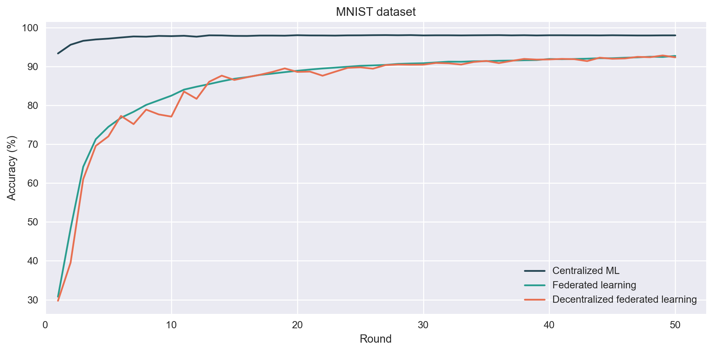
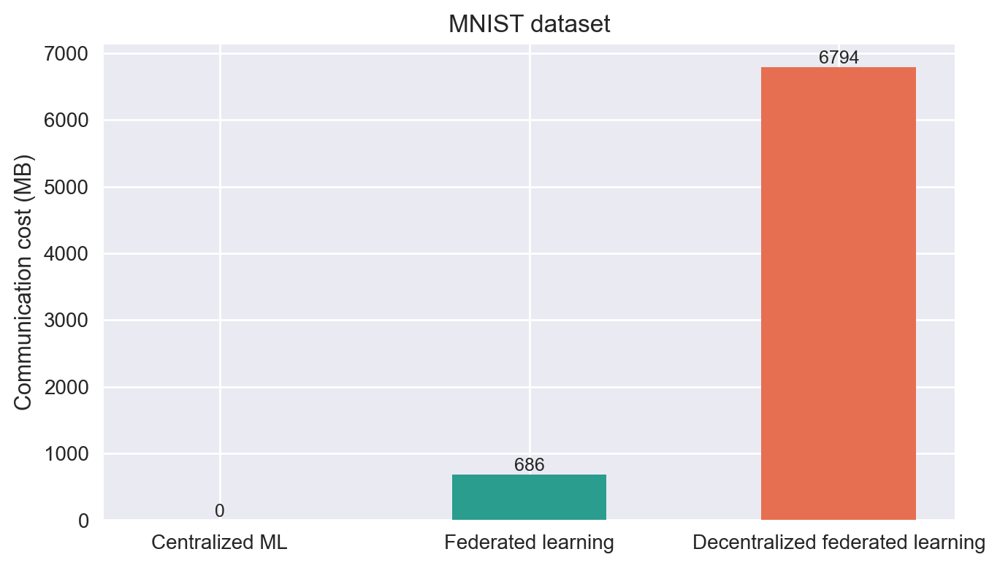
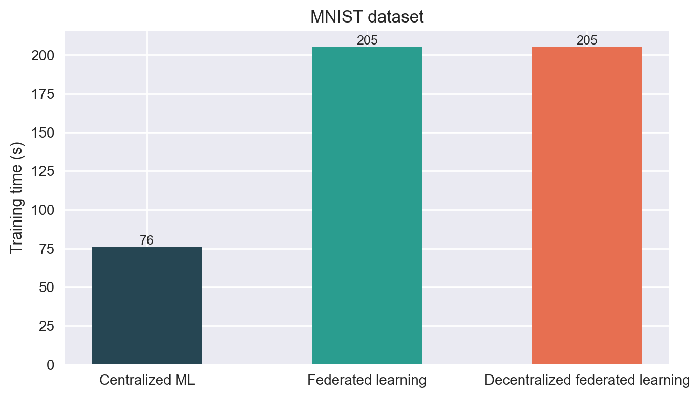

MNIST accuracy is usually highest for centralized learning. Federated and
Decentralized settings trade performance for privacy and distributed training.
Communication cost is higher in decentralized settings due to peer‑to‑peer exchanges.

---

## 7) Adding a Tabular Dataset: Adult

### 7.1 Dataset loader (added to Fluke)

We add a new loader in `fluke/data/datasets.py`. It reads a local CSV file,
extracts the label column `income`, splits train/test, and returns a `DataContainer`.
This enables Adult to be used exactly like built‑in datasets.

```python
@classmethod
def ADULT(
    cls,
    path: str = "../data",
    filename: str = "adult.csv",
    test_size: float = 0.2,
    seed: int = 42,
) -> DataContainer:
    """Load the Adult dataset from a local CSV file.

    Args:
        path (str, optional): Base path where the dataset is stored. Defaults to ``../data``.
        filename (str, optional): CSV file name. Defaults to ``adult.csv``.
        test_size (float, optional): Test split size. Defaults to 0.2.
        seed (int, optional): Random seed. Defaults to 42.

    Returns:
        DataContainer: The Adult dataset.
    """
    csv_path = os.path.join(path, "adult", filename)
    df = pd.read_csv(csv_path)
    if "income" not in df.columns:
        raise ValueError("Adult dataset CSV must include an 'income' column.")

    X = df.drop(columns=["income"]).to_numpy(dtype=np.float32)
    y = df["income"].to_numpy(dtype=np.int64)

    X_train, X_test, y_train, y_test = train_test_split(
        X, y, test_size=test_size, random_state=seed, stratify=y
    )

    return DataContainer(
        torch.tensor(X_train, dtype=torch.float32),
        torch.tensor(y_train, dtype=torch.long),
        torch.tensor(X_test, dtype=torch.float32),
        torch.tensor(y_test, dtype=torch.long),
        2,
    )
```

Register the dataset name in `fluke/data/datasets.py`:

```python
Datasets._DATASET_MAP = {
    "mnist": Datasets.MNIST,
    "svhn": Datasets.SVHN,
    "mnistm": Datasets.MNISTM,
    "adult": Datasets.ADULT,
    "femnist": Datasets.FEMNIST,
    "emnist": Datasets.EMNIST,
    "cifar10": Datasets.CIFAR10,
    "cifar100": Datasets.CIFAR100,
    "tiny_imagenet": Datasets.TINY_IMAGENET,
    "shakespeare": Datasets.SHAKESPEARE,
    "fashion_mnist": Datasets.FASHION_MNIST,
    "cinic10": Datasets.CINIC10,
    "fcube": Datasets.FCUBE,
}
```

### 7.2 Tabular models (added to Fluke)

We add three tabular models to `fluke/nets.py`:
- Logistic Regression (Adult_LogReg)
- Linear SVM (Adult_SVM)
- MLP (Adult_MLP)

These models are simple and compatible with FedAvg.

```python
class Adult_LogReg(nn.Module):
    """Logistic regression for tabular datasets like Adult."""

    def __init__(self, input_dim: int | None = None, output_size: int = 2):
        super().__init__()
        if input_dim is None:
            self.fc = nn.LazyLinear(output_size)
        else:
            self.fc = nn.Linear(input_dim, output_size)

    def forward(self, x: torch.Tensor) -> torch.Tensor:
        return self.fc(x)

class Adult_SVM(nn.Module):
    """Linear SVM-style classifier for tabular datasets like Adult."""

    def __init__(self, input_dim: int | None = None, output_size: int = 2):
        super().__init__()
        if input_dim is None:
            self.fc = nn.LazyLinear(output_size)
        else:
            self.fc = nn.Linear(input_dim, output_size)

    def forward(self, x: torch.Tensor) -> torch.Tensor:
        return self.fc(x)

class Adult_MLP(nn.Module):
    """Simple MLP for tabular datasets like Adult."""

    def __init__(self, input_dim: int, hidden1: int = 64, hidden2: int = 32, output_size: int = 2):
        super().__init__()
        self.fc1 = nn.Linear(input_dim, hidden1)
        self.fc2 = nn.Linear(hidden1, hidden2)
        self.fc3 = nn.Linear(hidden2, output_size)

    def forward(self, x: torch.Tensor) -> torch.Tensor:
        x = F.relu(self.fc1(x))
        x = F.relu(self.fc2(x))
        return self.fc3(x)
```

### 7.3 Auto‑inject input_dim

We inject `input_dim` automatically so the tabular models can be configured
only by name in YAML.

```python
def _maybe_set_input_dim(cfg: Configuration, num_features: int) -> None:
    model_name = cfg.method.hyperparameters.model
    if isinstance(model_name, str):
        model_base = model_name.split(".")[-1]
        if model_base in {"Adult_LogReg", "Adult_SVM", "Adult_MLP"}:
            if "net_args" not in cfg.method.hyperparameters:
                cfg.method.hyperparameters.net_args = DDict()
            net_args = cfg.method.hyperparameters.net_args
            if "input_dim" not in net_args:
                net_args["input_dim"] = num_features
```

### 7.4 Adult config changes

Apply these changes to your existing configs:

`config/exp.yaml` (dataset + logger + protocol)

```yaml
data:
  dataset:
    name: adult
    path: ./data
```

`config/fedavg.yaml` for Adult LR

```yaml
hyperparameters:
  model: Adult_LogReg
  net_args:
    input_dim: 14
```

`config/fedavg.yaml` for Adult MLP

```yaml
hyperparameters:
  model: Adult_MLP
  net_args:
    hidden1: 64
    hidden2: 32
```

---

## 8) Results – Adult LR and Adult MLP

Run centralized, FL, and decentralized experiments:

```bash
# Adult LR
fluke centralized config/exp-adult.yaml config/fedavg-adult.yaml
fluke federation config/exp-adult.yaml config/fedavg-adult.yaml
fluke decentralized config/exp-adult.yaml config/decentralized_fedavg.yaml
```

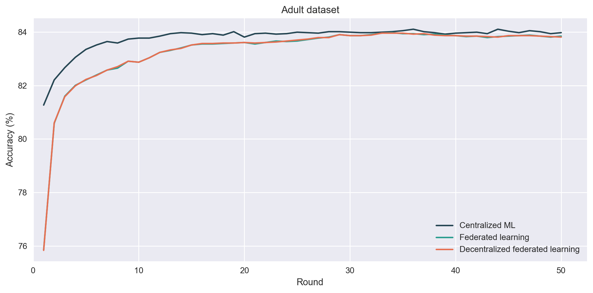 

Adult LR shows the same trade‑off as MNIST: centralized training typically
achieves the best accuracy, while federated and decentralized setups increase
communication and training time.

```bash
# Adult MLP
fluke centralized config/exp-adult.yaml config/fedavg-adult-mlp.yaml
fluke federation config/exp-adult.yaml config/fedavg-adult-mlp.yaml
fluke decentralized config/exp-adult.yaml config/decentralized_fedavg.yaml
```

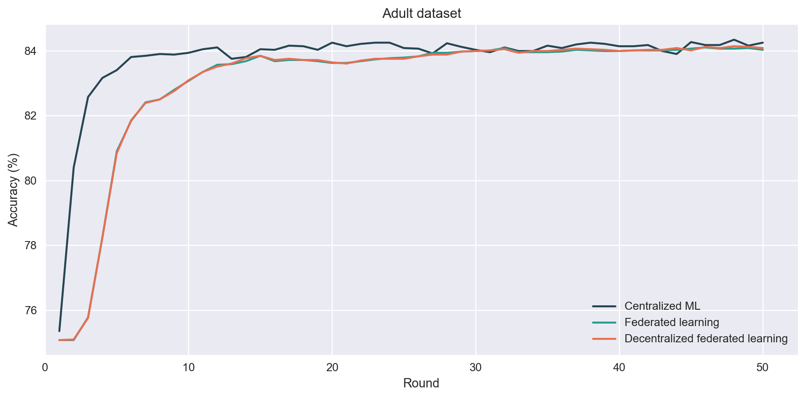 

Adult MLP usually reaches higher accuracy than LR, but with higher computation
cost.  

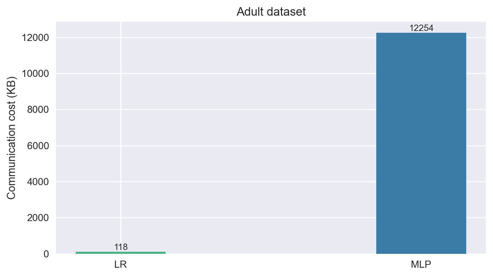
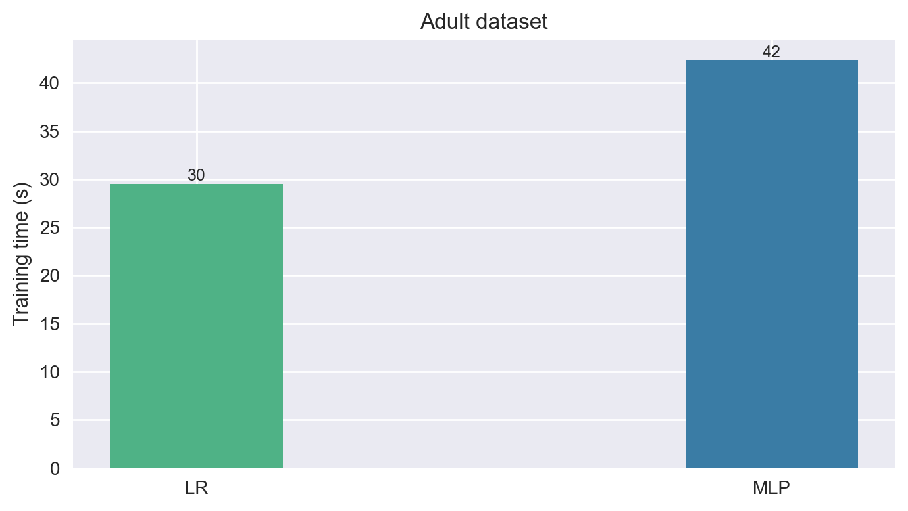 

---

## 9) Cost‑to‑Accuracy

We use cost‑to‑accuracy to quantify how much **communication** and **training time**
are required to reach a given fraction of the final accuracy (70/80/90/100%).
This makes cost/performance trade‑offs explicit.

### Adult LR vs Adult MLP (FL)

Cost‑to‑accuracy summarizes how much communication/time is required to reach a
fraction of the final accuracy (70/80/90/100%). This highlights the trade‑off
between efficiency and performance.

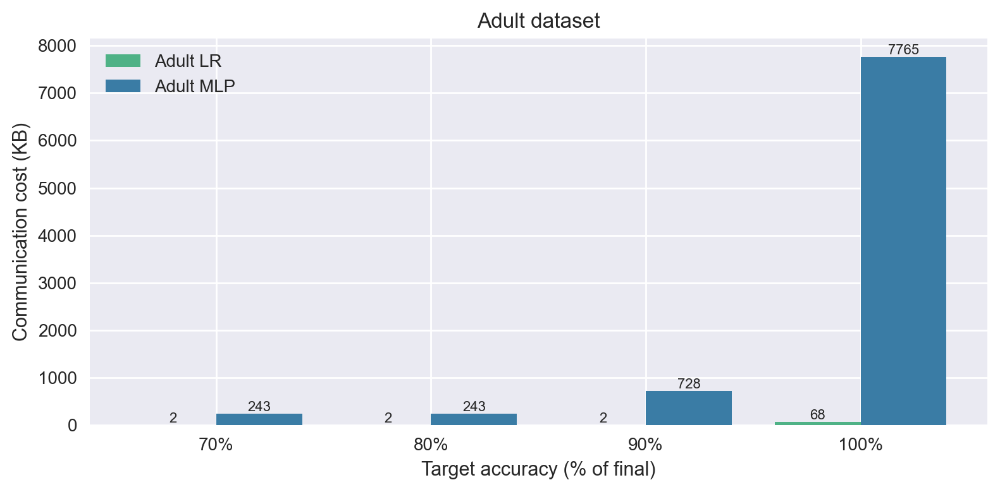
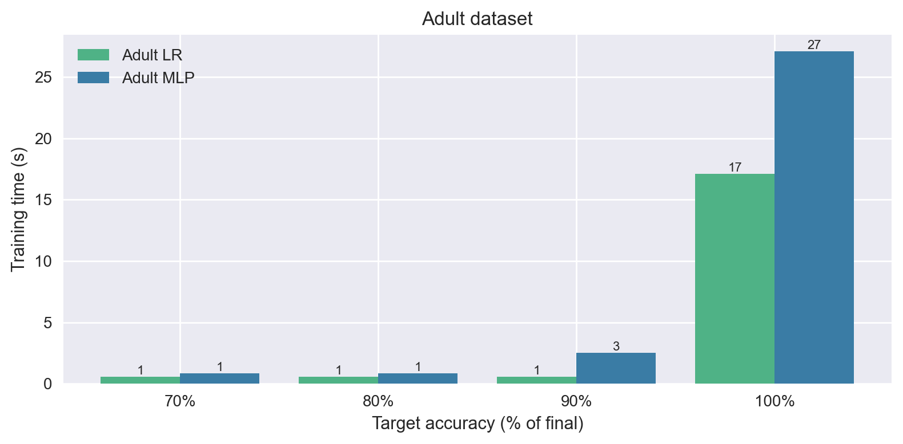

### MNIST vs Adult (FL)

We also compare MNIST against Adult to show how dataset type impacts
communication and computation costs.

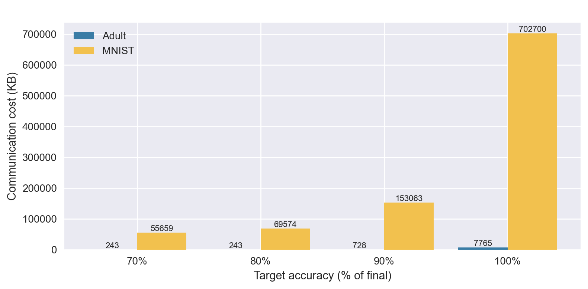
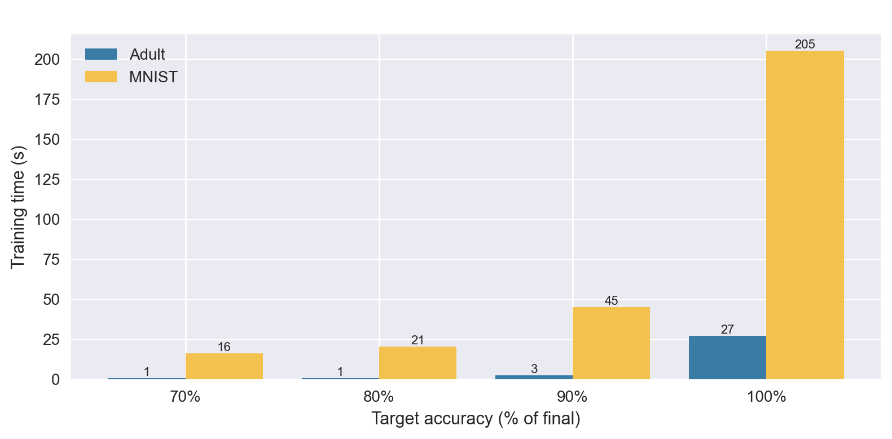

MNIST typically reaches higher accuracy faster, while Adult MLP shows higher
training time due to tabular preprocessing and different optimization dynamics.

---

## 10) Advanced Cost Analysis

We evaluate how FL costs change when we vary local epochs or the selected
client ratio.

### 10.1 Selected Clients (%)

Runs:
- `runs/fluke_mnist_noniid_traces-cl-20`
- `runs/fluke_mnist_noniid_traces-cl-40`
- `runs/fluke_mnist_noniid_traces-cl-60`
- `runs/fluke_mnist_noniid_traces-cl-80`
- `runs/fluke_mnist_noniid_traces-cl-100`

Selecting more clients per round increases communication cost, but can stabilize
training and improve global performance.

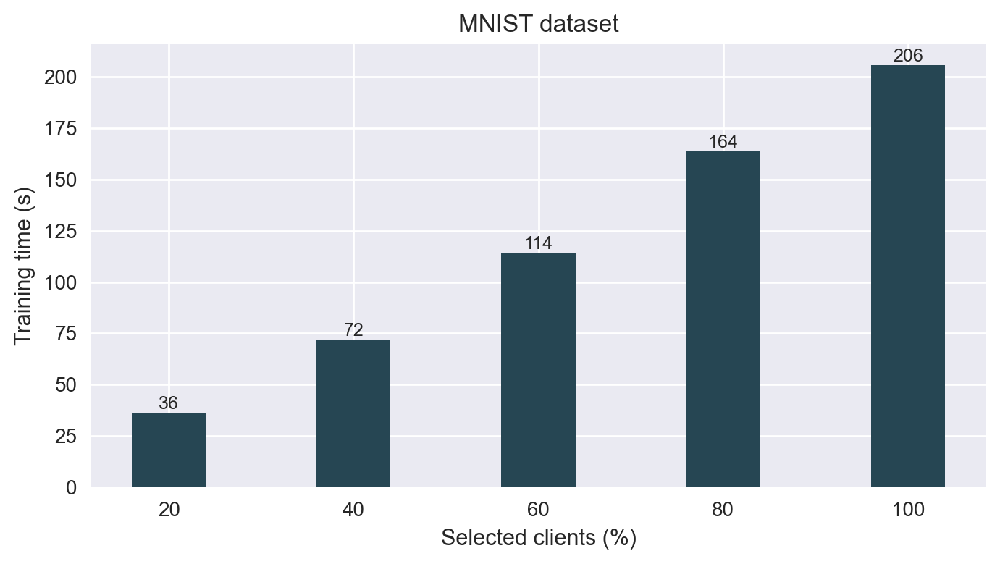
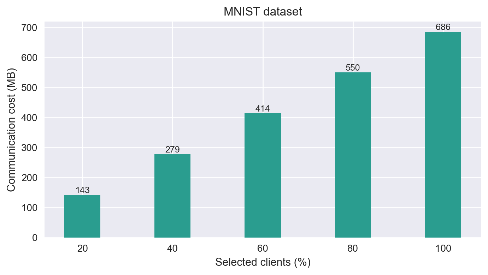
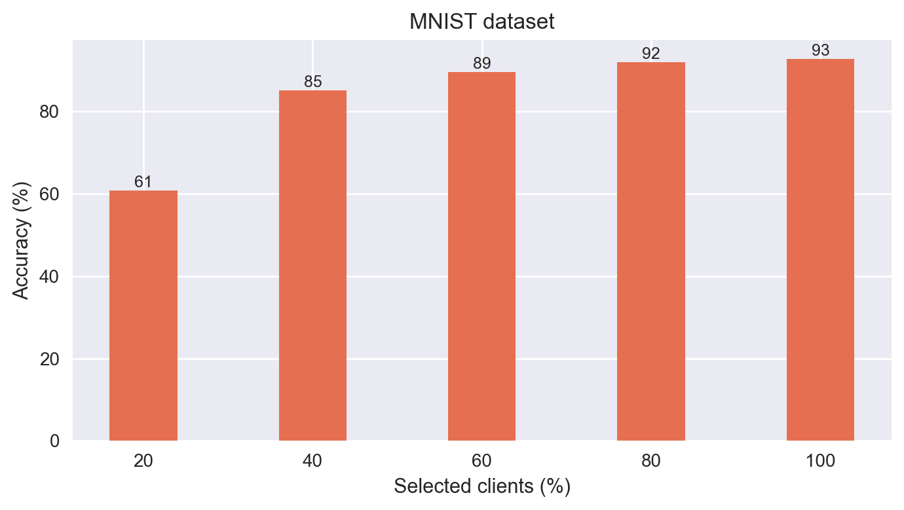

### 10.2 Local Epochs

Runs:
- `runs/fluke_mnist_noniid_traces-lep-5`
- `runs/fluke_mnist_noniid_traces-lep-10`
- `runs/fluke_mnist_noniid_traces-lep-20`
- `runs/fluke_mnist_noniid_traces-lep-30`

Increasing local epochs often improves accuracy but can increase computation
cost per round and sometimes degrade generalization under non‑IID data.


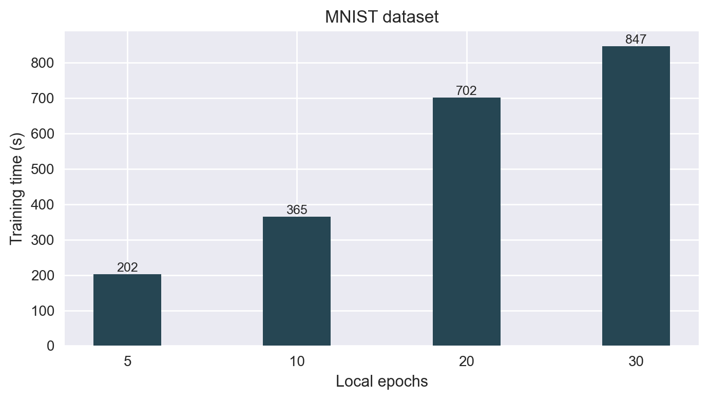
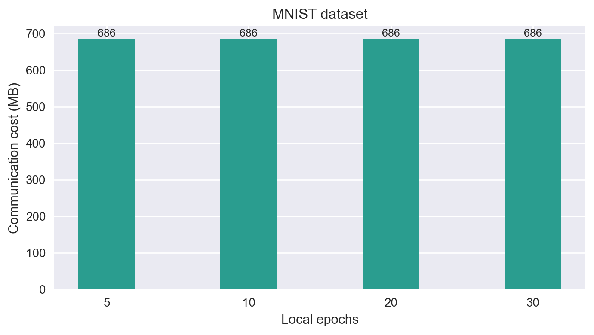
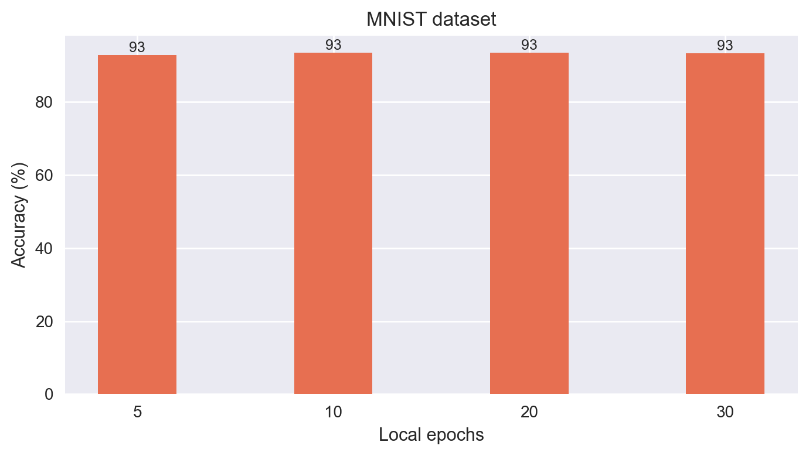

---

## 11) Reproduce All Plots

Open and run the notebook:

```
runs/mooc_tp_notebook.ipynb
```

It is organized in the same order as this README.
